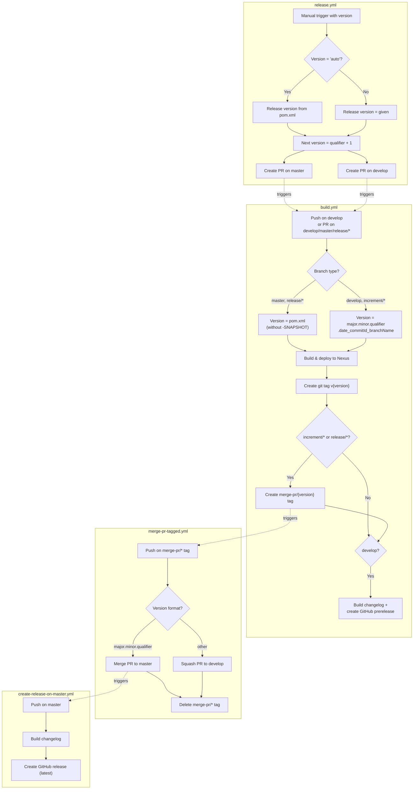

# CI/CD Flow and Branch Strategy

This project follows [GitFlow](https://www.atlassian.com/git/tutorials/comparing-workflows/gitflow-workflow) for branching and versioning.

## Branch Types

| Branch Pattern | Base | Purpose | Merges Into |
|----------------|------|---------|-------------|
| `develop` | — | Main development branch; latest development sources | — |
| `feature/JNG-NUMBER_summary` | `develop` | New features for the next version | `develop` |
| `release/X.Y-betaN` | `develop` | Stabilization before release | `master` + `develop` |
| `bugfix/JNG-NUMBER_summary` | release branch | Bug fixes during release stabilization | release branch + `develop` |
| `support/JNG-NUMBER_summary` | release branch | Minor changes to a previous release | release branch |
| `hotfix/JNG-NUMBER_summary` | `master` | Critical fixes to production | `master` + `develop` |
| `master` | — | Latest released version | — |

```mermaid
gitGraph
    commit id: "initial"
    branch develop
    commit id: "dev-1"
    branch feature/JNG-1
    commit id: "feat-1"
    commit id: "feat-2"
    checkout develop
    merge feature/JNG-1 id: "merge-feat"
    branch release/1.0-beta1
    commit id: "stabilize"
    branch bugfix/JNG-4
    commit id: "fix"
    checkout release/1.0-beta1
    merge bugfix/JNG-4 id: "merge-fix"
    checkout develop
    merge release/1.0-beta1 id: "back-merge"
    checkout master
    merge release/1.0-beta1 id: "release-1.0"
```

## Version Numbering

Versions follow semantic versioning with these rules:

- **Feature branches**: do not change version numbers
- **Starting a release branch**: increment the 2nd number on `develop`
- **Bugfix branches**: do not change version numbers (applied to release branches before they reach `master`)
- **Support branches**: increment the 3rd number when started
- **Hotfix branches**: increment the 4th number when started

## GitHub Actions Workflows

The CI/CD pipeline consists of four interconnected workflows:



### Workflow Summary

1. **build.yml** — Triggered on pushes to `develop` and PRs targeting `develop`, `master`, or `release/*`. Builds, tests, deploys to Nexus, creates version tags, and publishes GitHub prereleases for `develop`.

2. **merge-pr-tagged.yml** — Triggered by `merge-pr/*` tags (created by build.yml). Merges PRs to `master` (for release versions) or squashes to `develop` (for development versions).

3. **create-release-on-master.yml** — Triggered on pushes to `master`. Generates a changelog and creates a GitHub release marked as "latest".

4. **release.yml** — Manually triggered with a version number (or `'auto'`). Creates two PRs: one targeting `master` with the release version, and one targeting `develop` with the next development version.

## Development Rules

> **Important:** There is no commit without a ticket number. Every commit and PR must reference a JIRA ticket in the format `JNG-xxx`.

Issue tracking is managed in [JIRA](https://blackbelt.atlassian.net/jira/dashboards).
