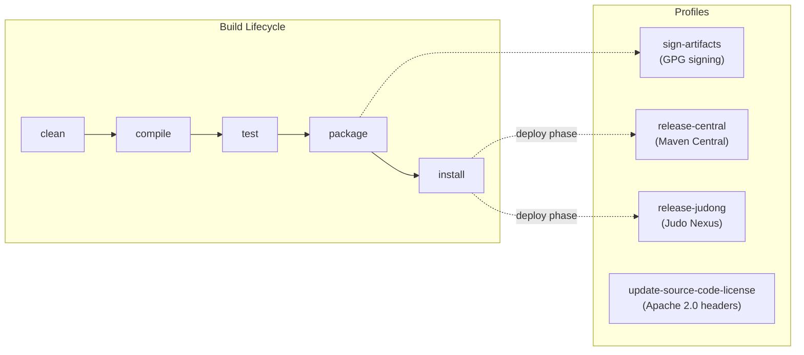

# Contributing to openapi-generator-cxf-jaxrs-client-osgi-ds

## Development Environment

### Required Tools

| Tool | Version | Distribution |
|------|---------|-------------|
| JDK | 21 | [Zulu JDK](https://www.azul.com/downloads/?version=java-21-lts&package=jdk) recommended |
| Maven | 3.9.4+ | Included via Maven Wrapper (`./mvnw`) |

Verify your setup:

```bash
java -version
# Expected: openjdk version "21.x.x" ...

./mvnw -version
# Expected: Apache Maven 3.9.x ...
```

> **Note:** The Maven Wrapper (`mvnw` / `mvnw.cmd`) is included in the repository, so you don't need a system-wide Maven installation. JVM settings are preconfigured in `.mvn/jvm.config` (1 GB min heap, 2 GB max).

## Build Commands

```bash
# Run unit tests only
./mvnw clean test

# Full build (unit tests + integration tests + install to local repo)
./mvnw clean install
```

### What the Tests Do

The **unit test** (`SampleRunner`) runs the generator programmatically against a sample OpenAPI spec (`src/test/resources/test.yaml`) and writes the output to `target/SampleRunner/`.

The **integration test** (`src/it/k8s/`) uses the Maven Invoker Plugin to:
1. Generate code from a test OpenAPI spec using the plugin
2. Run `mvn clean test` on the generated project
3. Verify compilation and test success via a Groovy script (`verify.groovy`)

## Project Structure

```
├── src/
│   ├── main/java/hu/blackbelt/openapi/codegen/
│   │   └── JavaCXFClientOsgiDsCodegen.java    ← the sole generator class
│   ├── main/resources/
│   │   ├── JavaJaxRS/cxf/osgi/ds/
│   │   │   ├── modelServiceActivator.mustache  ← OSGi DS activator template
│   │   │   └── pom.mustache                    ← generated project POM template
│   │   └── META-INF/services/
│   │       └── org.openapitools.codegen.CodegenConfig  ← SPI registration
│   └── test/
│       ├── java/.../SampleRunner.java
│       └── resources/test.yaml
├── src/it/k8s/                                 ← integration test (Maven Invoker)
├── pom.xml
└── .github/workflows/build.yml                 ← CI/CD
```



## Submission Guidelines

### Issue Reports

Before submitting, search the [issue tracker](https://github.com/BlackBeltTechnology/openapi-generator-cxf-jaxrs-client-osgi-ds/issues) for existing reports. Include:

- Output of `java -version` and `mvn -version`
- Your `pom.xml` or `.flattened-pom.xml`
- A minimal reproducing OpenAPI spec

### Pull Requests

This project uses [GitHub's forking model](https://guides.github.com/activities/forking/). Fork the repo and submit PRs against the `develop` branch.

For details on the CI/CD pipeline and branch strategy, see [CI Flow](.github/CIFLOW.md).
