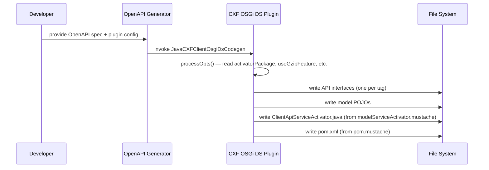
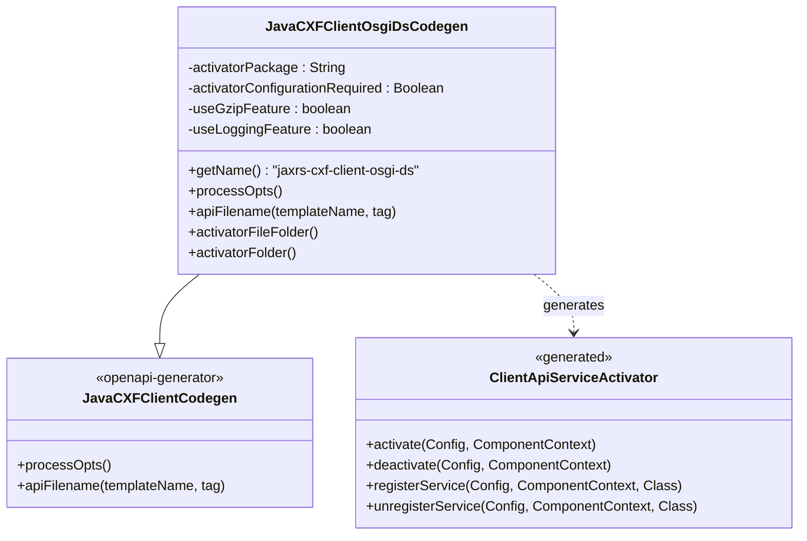
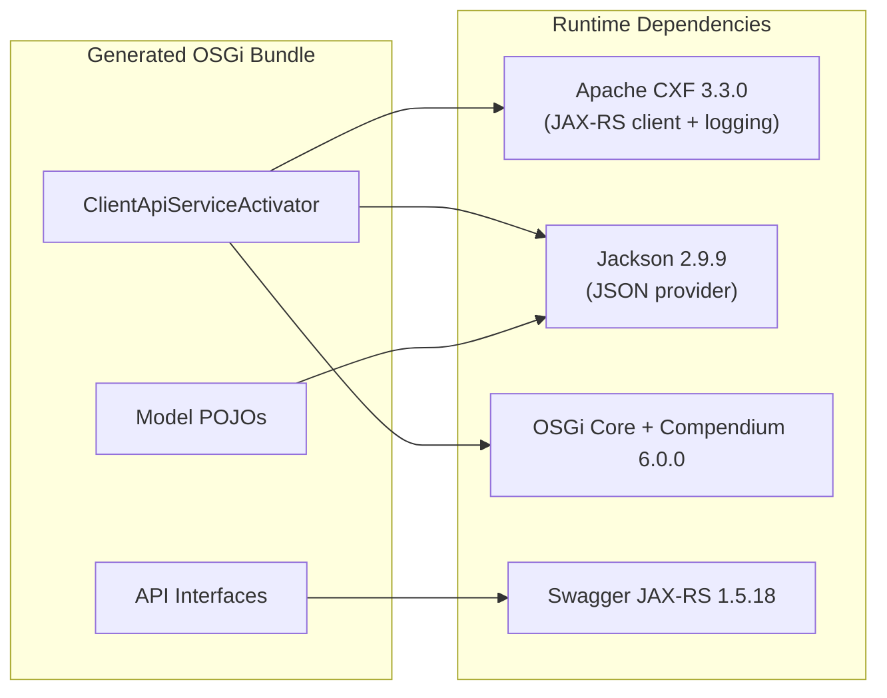

# JaxRS CXF Client OSGi Bundle Generator Plugin

An [OpenAPI Generator](https://openapi-generator.tech/) plugin that produces CXF JAX-RS client stubs packaged as OSGi Declarative Services (DS) bundles. Given an OpenAPI 3.x specification, it generates:

- **JAX-RS client API interfaces** — one per API tag
- **Model classes** — Jackson-annotated POJOs for request/response types
- **OSGi DS activator** (`ClientApiServiceActivator.java`) — an `@Component` that creates CXF client proxies at activation time and registers each API interface as an OSGi service
- **Maven POM** — pre-configured for `bundle` packaging with correct Import-Package / Export-Package headers

The generator name is **`jaxrs-cxf-client-osgi-ds`**.

## How It Works

The plugin extends `JavaCXFClientCodegen` from OpenAPI Generator 4.2.2 and replaces its default supporting files with two custom Mustache templates (`pom.mustache` and `modelServiceActivator.mustache`). At generation time the activator iterates over every API tag and emits `JAXRSClientFactory.create(…)` calls, one per API interface.



## Architecture



### Generated OSGi Activator Behaviour

The generated `ClientApiServiceActivator` is an OSGi DS `@Component` (immediate) with an `@ObjectClassDefinition` configuration interface exposing:

| Property | Type | Default | Description |
|----------|------|---------|-------------|
| `endPoint` | String | basePath from spec | REST endpoint URL |
| `log_payload` | boolean | `useLoggingFeature` value | Enable CXF logging |
| `log_payload_limit` | int | 1000 | Max logged payload bytes |
| `connection_timeout` | int | 10000 | HTTP connection timeout (ms) |
| `receive_timeout` | int | 15000 | HTTP receive timeout (ms) |

On activation it creates a CXF client proxy for each API interface via `JAXRSClientFactory`, configures Jackson JSON provider, optional logging/GZIP features, HTTP timeouts, and registers each proxy as an OSGi service. On deactivation it unregisters all services.

## Usage

### Maven

```xml
<plugin>
    <groupId>org.openapitools</groupId>
    <artifactId>openapi-generator-maven-plugin</artifactId>
    <version>4.3.1</version>
    <dependencies>
        <dependency>
            <groupId>hu.blackbelt</groupId>
            <artifactId>hu.blackbelt.openapi.codegen.cxf-jaxrs-client-osgi-ds</artifactId>
            <version>1.0.1</version>
        </dependency>
    </dependencies>
    <executions>
        <execution>
            <id>jaxrs-cxf-client-osgi-ds</id>
            <goals><goal>generate</goal></goals>
            <phase>generate-sources</phase>
            <configuration>
                <output>${project.basedir}</output>
                <inputSpec>${project.basedir}/example-openapi.yaml</inputSpec>
                <generatorName>jaxrs-cxf-client-osgi-ds</generatorName>
                <apiPackage>org.example.api</apiPackage>
                <modelPackage>org.example.model</modelPackage>
                <artifactId>example-api</artifactId>
                <groupId>org.example</groupId>
                <artifactVersion>1.0.0-SNAPSHOT</artifactVersion>
                <additionalProperties>
                    <additionalProperty>activatorPackage=org.example.activator</additionalProperty>
                    <additionalProperty>java8=true</additionalProperty>
                </additionalProperties>
            </configuration>
        </execution>
    </executions>
</plugin>
```

### Gradle

```groovy
buildscript {
    repositories {
        mavenLocal()
        mavenCentral()
    }
    dependencies {
        classpath "hu.blackbelt:hu.blackbelt.openapi.codegen.cxf-jaxrs-client-osgi-ds:1.0.0"
    }
}

openApiGenerate {
    generatorName = "jaxrs-cxf-client-osgi-ds"
    inputSpec = openApiSpec
    outputDir = openApiOutputDir
    apiPackage = "com.your-company.api"
    modelPackage = "com.your-company.api.model"
    additionalProperties = ['key': 'value']
    configOptions = [:]
}
```

### Command Line

```bash
java -cp openapi-generator-cli-4.3.1.jar:hu.blackbelt.openapi.codegen.cxf-jaxrs-client-osgi-ds-1.0.0.jar \
  org.openapitools.codegen.OpenAPIGenerator generate \
  -i ../api/src/main/resources/counter.yaml \
  --additional-properties pubName=counterapi \
  -g jaxrs-cxf-client-osgi-ds
```

## Plugin-Specific Configuration Options

These options are unique to this plugin (passed as `additionalProperties` or `configOptions`):

| Option | Description | Default |
|--------|-------------|---------|
| `activatorPackage` | Java package for the generated activator class | `org.openapitools.activator` |
| `activatorDsConfigurationRequired` | If `true`, the OSGi component requires configuration before activation | `false` |
| `useGzipFeature` | Add GZIP in/out interceptors to the CXF client | `false` |
| `useLoggingFeature` | Add CXF `LoggingFeature` to the client and enable `log_payload` by default | `false` |

All other options are inherited from `JavaCXFClientCodegen` — see the [OpenAPI Generator docs](https://openapi-generator.tech/docs/configuration) for the full list. Common inherited options include `apiPackage`, `modelPackage`, `dateLibrary`, `java8`, `useBeanValidation`, `sourceFolder`, etc.

## Generated Output Dependency Stack

The generated project depends on these libraries (versions pinned in the generated POM):



## Release Notes

### 1.0.1
- Fixed `@Deactivate` method — previously two activate methods were generated
- Fixed import range of JAX-RS API (`javax.ws.rs;version="[1.1,3)"`)
- Handle `activatorPackage` parameter correctly
- All parameter handling improvements

### 1.0.0
- First release
